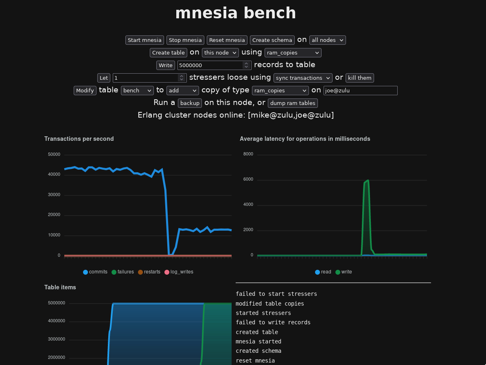

mnesia_bench
=====

Benchmarking stand for [mnesia](https://www.erlang.org/doc/man/mnesia.html).
Requires no dependencies apart from Erlang's standard library, and rebar.

Build
-----

    $ rebar3 compile

Run
---

    $ rebar3 shell --setcookie foo --sname mike
    # in another terminal
    $ erl -setcookie foo -sname joe
    # in eshell
    net_kernel:connect_node(mike@HOSTNAME).
    # Open http://localhost:4000 in a browser

Learnings
---------

- Mnesia has four access contexts that have different performance and consistency characteristics

  - Sync transactions are probably the best comparison to databases like PostgreSQL

  - dirty access is wicked fast

  - the user is given the choice between "go safe or go fast" almost everywhere

  - Transaction throughput gets lower as the cluster grows, as mnesia needs to
    talk to the other nodes

- For operations on large tables that need to work with a fixed table view via
  `ets:safe_fixtable`, fixtable can cause some problems: unfixing the table
  will take a while and this can cause a short drop in throughput

  - This is still better than the full table lock on e.g. PostgreSQL
